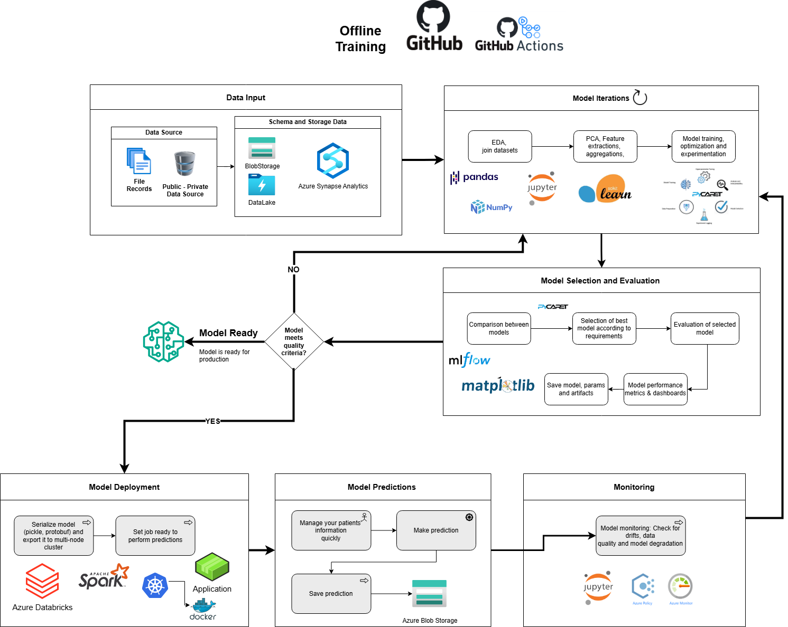

# MLOps Sample Pipeline Design -> V1.0

## Caso de estudio
### Antecedentes

Los avances tecnológicos han generado una abundancia de información sobre pacientes en el campo médico. Sin embargo, los datos sobre enfermedades raras, conocidas como enfermedades huérfanas, siguen siendo escasos. Es necesario desarrollar un modelo que prediga, basándose en los datos de síntomas de un paciente, la probabilidad de que padezca una enfermedad específica. Este modelo debe ser eficaz tanto para enfermedades comunes, que cuentan con abundantes datos, como para enfermedades huérfanas, donde los datos son limitados.

## Definición del problema

### Entrenamiento del modelo

El "Conjunto de Datos de Pacientes: Datos Demográficos y Clínicos" es una recopilación exhaustiva de información sobre 1500 personas diagnosticadas con enfermedades comunes y raras. Este conjunto de datos abarca una amplia gama de parámetros y proporciona información detallada sobre los perfiles demográficos y clínicos de estas personas.

Este conjunto de datos incluye detalles demográficos clave como edad, género, etnia, estado civil y nivel educativo, proporcionando una visión integral de la población muestral. Además, se registra información clínica, incluyendo la fecha de diagnóstico, la duración de los síntomas y cualquier diagnóstico previo, ofreciendo un contexto valioso sobre los historiales médicos de los pacientes.

Este conjunto de datos es un recurso esencial para investigadores, clínicos y profesionales de la salud que buscan mejorar su comprensión de los perfiles clínicos en una población de pacientes diversa. Proporciona datos completos para facilitar análisis avanzados y respaldar la toma de decisiones informadas en la investigación médica y la práctica clínica.

Este conjunto de datos esta conformado con por archivos y registros de historias clinicas de datos no estructuras almacenado en un DataLake y tablas de Azure Blonstorage,de origenes de datos publicos y privados.

El Análisis Exploratorio de Datos (EDA) descubre patrones, tendencias y anomalías en conjuntos de datos de atención médica mediante visualizaciones y métodos estadísticos. La unión de conjuntos de datos integra diversas fuentes, como historiales clínicos públicos y datos clínicos privados, creando una visión unificada de los perfiles de los pacientes. Este proceso garantiza la consistencia de los datos, enriquece la información y sienta una base sólida para el análisis avanzado y el modelado predictivo en la investigación médica.

El Análisis de Componentes Principales (PCA) reduce la dimensionalidad del conjunto de datos a la vez que preserva la varianza, simplificando el análisis de datos médicos complejos. La extracción de características identifica variables críticas, como la gravedad de los síntomas o los rasgos demográficos, lo que mejora el rendimiento del modelo. Las agregaciones consolidan los datos en resúmenes significativos, como el promedio de constantes vitales del paciente por tipo de enfermedad, lo que permite obtener información más clara y un procesamiento eficiente para el modelado predictivo y la toma de decisiones clínicas.

El entrenamiento de modelos implica el desarrollo de algoritmos predictivos utilizando datos de pacientes para identificar la probabilidad de enfermedades. La optimización afina los parámetros del modelo para mejorar la precisión y la eficiencia, especialmente en enfermedades raras con datos limitados. La experimentación prueba diversos algoritmos y configuraciones, garantizando un rendimiento robusto en enfermedades comunes y raras, y proporcionando información fiable y basada en datos para el diagnóstico clínico y los avances en la investigación médica.

#### Tarea de predicción

El modelo estará disponible en línea todo el tiempo (24/7). El modelo debe examinar los síntomas proporcionados por el médico, la información demográfica del paciente; edad, género, etnia, estado civil, nivel educativo y registros clínicos fecha de diagnóstico, duración de síntomas, diagnósticos anteriores para predecir con precisión la probabilidad de enfermedades comunes y raras.

---

### Parte 1: Diseño de Pipeline de Aprendizaje Automático

Según los requisitos y las etapas que se necesitan para el problema de clasificación, se propone el siguiente Diseño de Pipeline de Aprendizaje Automático :

The next sections explain in detail the proposed pipeline.

### Entrenamiento Offline
---
El entrenamiento offline comienza considerando a GitHub y GitHub Actions como los puntos de partida principales. Como en cualquier iteración de un modelo, el proceso de entrenamiento implica múltiples versiones, así como tareas y pruebas unitarias necesarias durante el desarrollo de nuevas versiones. En este contexto, GitHub —el proveedor por excelencia de repositorios— y GitHub Actions —la herramienta de integración y entrega continua (CI/CD) para desarrollo y pruebas— representan un punto de partida adecuado. Una vez que ambos están configurados para el nuevo modelo de clasificación, se da inicio al entrenamiento offline. Nota: se utilizará Python en todas las etapas que requieran un lenguaje de programación, a menos que se indique lo contrario.

---

##### Datos de entrada

El proceso de entrada de datos para el Conjunto de Datos de Pacientes: Datos Demográficos y Clínicos consta de dos etapas principales. 
Primero, se utiliza Azure Blob Storage para almacenar millones de archivos no estructurados (historias clínicas, datos demográficos) de fuentes públicas y privadas, garantizando escalabilidad, rápida recuperación y facilidad de uso mediante SDKs. Los archivos requieren preprocesamiento para normalizar formatos (como XML o JSON) y limpiar datos, especialmente para fuentes externas como registros médicos.

Posteriormente, los datos transformados se almacenan en Azure Synapse Analytics, que ofrece integración nativa con Azure Blob Storage y capacidades SQL avanzadas para consultas eficientes, ideales para preparar datos para el entrenamiento de modelos de Machine Learning. Opcionalmente puede emplearse un versionador los conjuntos de datos, permitiendo gestionar diferentes versiones de datos recuperados desde Azure Blob Storage o Synapse Analytics, similar al versionamiento de código con Git, dado que este funcionalidad ya es ofrecida por los proveedores de nube.

Este flujo optimiza la preparación de datos diversos, asegurando calidad y accesibilidad para entrenar modelos predictivos que diagnostiquen enfermedades comunes y raras con precisión.

---

##### Model Iterations
---
Una vez que los datos han sido transformados e incorporados al almacén de datos requerido, es momento de iniciar las iteraciones del modelo. El primer paso debe implicar la búsqueda de elementos críticos como campos faltantes, archivos corruptos, incompatibilidades de tipo y casos atípicos inesperados. Cuando los datos estén preparados, podemos realizar un Análisis Exploratorio de Datos (EDA) completo. Esta exploración nos permitirá comprender con mayor profundidad las características y metadatos presentes en todos los archivos y registros.
A continuación, se aplican procesos de extracción, agregación y selección de variables, integrando técnicas como el Análisis de Componentes Principales (PCA). PCA ayuda a reducir la dimensionalidad del dataset eliminando redundancias y conservando la mayor parte de la información relevante. Esto no solo mejora la eficiencia computacional del entrenamiento, sino que también facilita la interpretación del modelo al enfocarse en las variables más influyentes. 

Después de definir el conjunto final de características, podemos comenzar a entrenar los modelos seleccionados para el propósito específico de clasificación. Como los datos provienen principalmente en forma tabular (tanto de registros de archivos como de fuentes externas)

Para el entrenamiento de modelos de clasificación, podemos hacer uso de [link](https://pycaret.gitbook.io/docs) PyCaret, una biblioteca de código abierto que simplifica los flujos de trabajo de machine learning. PyCaret es esencialmente un contenedor de Python alrededor de varias bibliotecas y marcos de aprendizaje automático, como scikit-learn, XGBoost, LightGBM, CatBoost, spaCy, Optuna, Hyperopt, Ray y algunos más. PyCaret cuenta con módulos especializados para aprendizaje supervisado (clasificación y regresión), no supervisado (clustering, detección de anomalías, NLP, minería de reglas de asociación). Todas las transformaciones de preprocesamiento que se definen de forma sencilla a través de su función setup, lo que permite acelerar la preparación y comparación de modelos con mínima intervención manual.

Con los resultados almacenados y documentados, se realiza un análisis comparativo para seleccionar el modelo más robusto y alineado con los criterios de rendimiento y precisión definidos para el diagnóstico médico.

--- 

##### Selección y evaluación de modelos
Como hay diferentes modelos para comparar, podemos comenzar evaluando directamente las métricas de resultados importantes para la clasificación, como ROC AUC, puntuación F1, precisión, entre otras. Dado que los modelos intentan estimar categorías, la matriz de confusión y sus métricas relacionadas son también muy relevantes. Además, estos modelos pueden compararse por su complejidad temporal y espacial, lo que impacta directamente en los recursos que necesitarán una vez en producción y el tiempo que toman para realizar inferencias. Luego, podemos realizar una validación cruzada k-fold entre ellos para probarlos directamente con diferentes conjuntos de entrenamiento, prueba y validación.
Una vez seleccionado el mejor modelo, se evalúa directamente según los requisitos previamente definidos. Estos pueden estar relacionados con recursos, tiempos de inferencia, necesidades del negocio, facilidad de uso para el usuario final, entre otros. Esta evaluación debe conducir al establecimiento de las métricas finales de entrenamiento y su calibración.
Finalmente, todas estas métricas y resultados pueden exportarse a paneles de visualización, para que la decisión de elegir ese modelo esté bien fundamentada y pueda presentarse a todas las partes interesadas. Estas visualizaciones pueden lograrse usando matplotlib + mlflow, esta última potencia significativamente la eficiencia operativa, permitiendo comparaciones objetivas entre distintas aproximaciones metodológicas y facilitando la colaboración entre equipos multidisciplinares mediante interfaces unificadas para el registro, visualización y despliegue de soluciones analíticas avanzadas. Esto permite realizar predicciones, mostrar gráficos y visualizar los resultados utilizando una aplicación web con pocas líneas de código.

Opcional: Si el equipo necesita seguir colaborando con paneles y visualizaciones, Tableau podría ser una solución a considerar. Diferentes equipos pueden compartir conocimientos a través de esta herramienta si vale la pena la complejidad inicial de su configuración.

---

##### ¿Es hora de ponerlo en producción?

Finalmente, una vez realizada  la evaluación exhaustiva del modelo para determinar si cumple con los criterios mínimos de calidad requeridos para su implementación en entorno productivo. Este proceso de validación constituye un punto crítico de decisión respecto al ciclo de vida del desarrollo.
Si el modelo satisface los umbrales establecidos en términos de precisión, rendimiento computacional y otros indicadores relevantes, se transfiere formalmente al ingeniero responsable de su despliegue, quien ejecutará los protocolos técnicos necesarios para su integración en la infraestructura operativa.
En caso contrario, cuando el modelo no alcanza los estándares predefinidos, se direcciona nuevamente hacia la fase de iteración. En esta etapa recursiva, se realizarán los ajustes pertinentes en aspectos como la selección de características, configuración de hiperparámetros, o incluso la reconsideración de algoritmos alternativos que potencialmente ofrezcan un rendimiento superior para la problemática específica.
Este mecanismo de retroalimentación garantiza que únicamente los modelos que demuestren suficiente robustez y fiabilidad avancen hacia el entorno de producción, salvaguardando así la calidad de las predicciones y recomendaciones generadas por el sistema.

#### Publicar Modelo
Posterior a las fases de Iteraciones del Moledo, Selección y Evaluación del Modelo,  tras la identificación del candidato más prometedor, y de realizar una evaluación exhaustiva para verificar si las métricas obtenidas satisfacen los umbrales predefinidos para su implementación en entornos productivos.
La decisión de avanzar hacia la fase de producción debe fundamentarse en evidencia empírica sólida que respalde la capacidad del modelo para abordar efectivamente los requerimientos empresariales específicos, garantizando así un despliegue que genere valor tangible para la organización.

#### Implementación del modelo
Habitualmente, encapsulamos el modelo dentro de un contenedor y lo desplegamos para permitir que otros usuarios realicen predicciones con él, o para uso interno según se requiera. Para este problema específico, dado que necesitamos procesar varios millones de archivos diariamente dentro de una ventana de 30 minutos, el proceso demanda requisitos especializados de big data.
Para implementar las predicciones, necesitamos serializar el modelo (utilizando formatos como binarios pickle estándar o esquemas protobuf) y exportarlo a procesadores de big data. Para este modelo, podemos utilizar Azure HDInsight, Azure Databricks con Spark para realizar el procesamiento intensivo. Esta plataforma nos permite aprovechar plenamente la potencia de nodos de trabajo distribuidos para paralelizar la mayoría de las predicciones requeridas. Este clúster multi-nodo puede configurarse con el trabajo de predicción una vez que el modelo ha sido serializado y exportado, permitiéndonos utilizar PySpark para escribir el script necesario que active este trabajo desde una llamada externa. El concepto fundamental es preparar el modelo para que pueda activarse simplemente mediante la invocación de este trabajo predefinido.
Opcional: HDInsight puede configurarse para utilizar clústeres de Kubernetes. Se propone Kubernetes como opción si existen diferentes necesidades de infraestructura para el equipo de Ciencia de Datos y otras unidades. La principal ventaja de Kubernetes radica en que podemos desplegar recursos según sea necesario para los modelos de aprendizaje automático, y Azure Kubernetes Service (EKS) puede gestionar todos los nodos distribuidos por nosotros.
La arquitectura basada en Azure ofrece ventajas significativas en términos de escalabilidad, integración con otros servicios de Microsoft y capacidades avanzadas de monitorización a través de Azure Monitor, proporcionando una solución robusta que cumple con los exigentes requisitos temporales y de procesamiento del caso.

---

#### Predicciones del modelo
Una vez implementado en el entorno productivo, el sistema de predicción médica operará con disponibilidad ininterrumpida las veinticuatro horas del día, durante los siete días de la semana, garantizando acceso permanente para el personal médico. La arquitectura ha sido diseñada para proporcionar predicciones en tiempo real bajo demanda, respondiendo de manera inmediata a las solicitudes de los profesionales.
Las prediciones se almacenan de forma extructura en Storaga de Azure.

---

#### Model Monitoring

Aunque posiblemente no constituya un requisito inmediato, resulta altamente recomendable implementar un proceso exhaustivo de monitorización del modelo para identificar desviaciones, problemas de calidad de datos y degradación del rendimiento predictivo. Esta fase, crítica pero frecuentemente desatendida en numerosos flujos de trabajo de aprendizaje automático, adquiere relevancia estratégica en un sector tan exigente como el financiero.
La implementación de Azure Monitor facilita la detección temprana de anomalías y permite adoptar medidas correctivas proactivas antes de que estas repercutan negativamente en los resultados empresariales. El sistema puede configurarse para generar notificaciones automáticas cuando los indicadores de rendimiento se desvían significativamente de los parámetros esperados.
En caso necesario, podemos reentrenar el modelo mediante un proceso cíclico que retorna desde la etapa de iteración del modelo hasta su posterior despliegue, aprovechando la integración nativa entre los componentes de Azure Machine Learning y las herramientas de orquestación de Azure, como Azure Data Factory, para automatizar este proceso de actualización.
Esta aproximación proactiva a la monitorización garantiza la fiabilidad continua de las soluciones predictivas en entornos financieros de alta exigencia, donde la precisión y consistencia de los resultados resultan imperativas para mantener la confianza de usuarios y partes interesadas.

